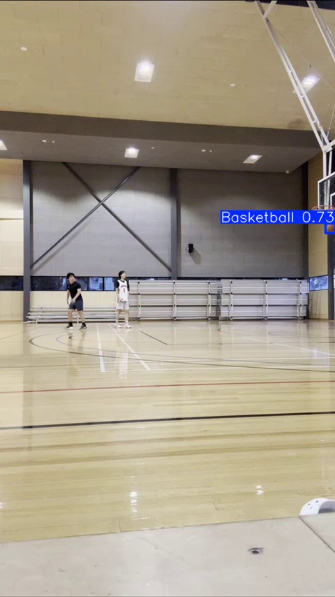

# 🏀 HoopCut Basketball Clip Cutting Software

**Automate Highlight Editing with AI-Powered Shot Detection!**

HoopCut is a powerful drag-and-drop video editing solution that uses custom-trained AI models to detect basketballs and hoops, automatically determining if shots are makes or misses and cutting clips accordingly. All wrapped together in a sleek web interface.

> **Tested on over 1 hour of side view footage with 95% accuracy**

---

## 🚀 Project Overview

HoopCut combines cutting-edge computer vision with efficient video processing:

- **Backend**: YOLOv8 and Python with two custom-trained models (ball detection + hoop detection)
- **Video Processing**: FFMpeg for efficient clip editing and file format conversion
- **Performance**: Supports both CPU and GPU versions (GPU recommended for faster speeds)
- **Frontend**: Vanilla JavaScript, HTML, and CSS connected via Flask

---

## 🚀 Getting Started

### 1. Clone the Repository (if you have a github token) or Download the EXE
```bash
git clone https://github.com/ericbh22/HoopCut_FH.git
cd HoopCut_FH
```

2. **Create a virtual environment**
```bash
# On Windows
python -m venv venv

# On macOS/Linux/Python 3
python3 -m venv venv 
```

3. **Activate virtual environment**
```bash
# On macOS/Linux
source venv/bin/activate

# On Windows
venv\Scripts\activate
```

4. **Install dependencies (may take a few minutes)**
```bash
pip install -r requirements.txt
```


5. Run the Application
```bash
# On Windows
python main\app.py 

# On macOS/Linux
python3 main/app.py 
```

6. Run the Application
```bash
Copy "http://127.0.0.1:5000" into your browser or click on it from the terminal
```

7. Feel free to use our test in provided_test

**Additional Requirements:**
- Ensure FFMpeg is installed on your system
- If you see WINERROR, it means your system needs ffmpeg - see this video for a guide https://www.youtube.com/watch?v=K7znsMo_48I
- If errors occur, verify GPU version of PyTorch is installed


The application will be hosted locally and accessible through your web browser. 

---

## 🧮 Analysis Explanation

To accurately determine shot outcomes, HoopCut employs two mathematical models:

### 1. Linear Model (Primary)
- Takes the last point identified above the rim
- Takes the first point identified below the rim (by position, not time)
- Creates a linear equation between these points
- **Result**: Shot detected as made if the line intersects the hoop

### 2. Quadratic Model (Secondary)
- Uses all ball instances detected above the rim to form a parabola
- Determines if the parabola intersects both rim points (front and back)
- Creates a second parabola using only the last 10 points for increased accuracy
- Accounts for shots that bounce off the backboard or have long air time
- **Result**: Shot detected as made only if both parabolas return `True`

### Trajectory Analysis Examples
<div align="center">
  <figure style="display: inline-block; margin: 10px; vertical-align: top;">
    
    <figcaption style="font-size: 0.9em; color: #666; margin-top: 5px; font-style: italic;">Full trajectory displaying miss</figcaption>
  </figure>
  <figure style="display: inline-block; margin: 10px; vertical-align: top;">
    
    <figcaption style="font-size: 0.9em; color: #666; margin-top: 5px; font-style: italic;">Last 10 trajectory displaying make</figcaption>
  </figure>
</div>

---

## ✨ Key Features

### 🎬 Automated Editing
Leverages FFMpeg and two custom trained image detection models for hoops and basketballs 

<div align="center">
  <figure style="display: inline-block; margin: 10px; vertical-align: top;">
    
    <figcaption style="font-size: 0.9em; color: #666; margin-top: 5px; font-style: italic;">Ball detection model identifying basketball in game footage</figcaption>
  </figure>
  <figure style="display: inline-block; margin: 10px; vertical-align: top;">
    
    <figcaption style="font-size: 0.9em; color: #666; margin-top: 5px; font-style: italic;">Hoop detection model identifying basketball rim</figcaption>
  </figure>
</div>

### 🎯 Shot Analysis
Utilizes Matplotlib to create detailed plots of shot trajectory

<div align="center">
  
</div>

### ⚡ GPU and CPU Calibration
Automatically switches to GPU compute when available for faster processing

### 🎯 Three Point Calibration
Built-in three-point features to improve accuracy for longer range shots

### 🏷️ Custom Relabeling
Allows users to relabel mislabeled footage into makes or misses


---
## 🚀 Optimal Usage and FAQ
### 1. What footage can I use?
The model has been trained on all angles, so all footage works, but side on works best. Try to make sure the hoop moves minimally during the footage.
### 2. How long does it take? 
Depending on GPU, the time varies greatly.
### 3. Should I use the auto AI hoop detection?
Yes, it is recommended to use the auto AI detection over manual selection


---

## ⚠️ Known Issues

| Issue | Description |
|-------|-------------|
| 🎯 **Shot Angle Limitations** | Corner airballs may appear as makes due to single-angle implementation |
| 🏀 **Three-Pointer Accuracy** | Lower accuracy ~ 75% on long-range shots due to distance causing visual ambiguity |
| 🤾 **Non-Shot Detection** | Lobs and other non-shot attempts above the rim are incorrectly detected as shots |
| 🎨 **Equipment Variations** | Model accuracy decreases with non-standard basketballs and hoops (e.g., rainbow-colored balls) |
| 🌐 **Browser Compatibility** | Select hoop sometimes plays video instead (tested on Chrome and Zen Browser only) |
| 🎥 **Media Issues** | Rare color grading or sound issues depending on original recording device |

---

## Future Plans
1. Advanced analytics: Analyse dribbling patterns and shot patterns to determine shot distance, shot type (fadeaways, step backs) and dribble moves (crossover, hang dribble)
2. Advanced Editing: Cut out extended periods where no basketball is detected automatically 
3. Unique Person identifcation: Allows users to select which player they are and generate more tailored highlights 


**Made with ❤️ for hoopers!**

